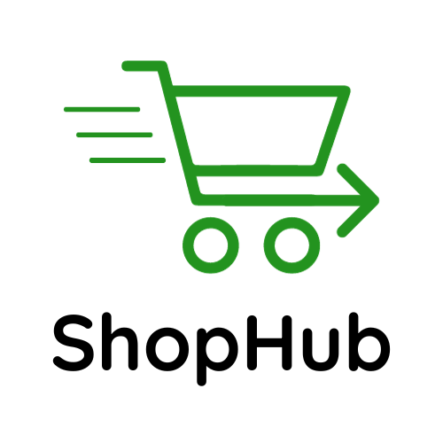
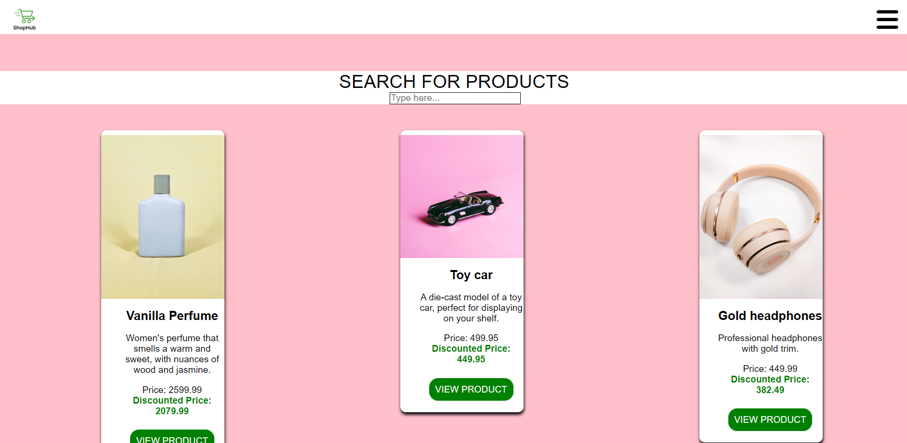

# SHOPHUB 
  

This was a Javascript Frameworks CA. We were tasked with creating an ecom website where users can search products by title, add the products to a cart and successfully checkout. Also they would be able to submit a contact form. 

## Description

The user can search products by title. This is done by typing letters in the search input field and then the filtered list will be displayed with the matching products. Each product card provides an image, description and a price. If the price is discounted, this will be sorted through a function and displayed instead of the regular price.
When the user clicks on the "view product" button, they will be taken to a products details page, where more detailed information about the product will be displayed. Here the user can click on a button to add one item of the product to the cart. The total amount of products added to the cart will be shown next to the "cart" link in the navigation menu.
On the cart page all products will be displayed by product name. Every product is calculated to a total amount and then all of the total amounts are calculated to a total sum for the entire cart. Next to the total sum, the user can click a checkout button. This will clear the local storage and send the user to a new page with a message of a successful checkout.
On the contact page, there is a contact form the user need to fill out if they want to send a message to the website. There are requirements for the different inputs, and if they are not met then the user is given an error message explaining what they need to do. When all required fields are correctly filled, then the form can be submitted successfully.

## Built With

- CSS
- HTML
- React
- Javascript

## Getting Started

## Installing and running

In the repo, press the green code button and then open the project on github desktop. After you then have cloned it to your device, open the project in VS-code or other desired coding software. In the projects terminal, type and run "npm i". After this type "npm start" in the same terminal and the website will open in a new tab in your local browser.

## Contact

If you have any questions or otherwise want to get in touch, you can reach me on my email: audunroald@gmail.com.
